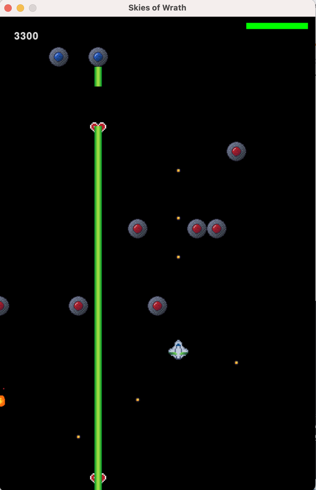

# skies-of-wrath
[Github](https://github.com/PlayitLOUD73/skies-of-wrath)
Demo: gameDemo.m4v

## Introduction

### Skies of Wrath



### How to Download and Play
1. Clone the repository
2. run ```python3 main.py``` 
   1. this could differ based on how python is installed on your system, mine happens to be python3.9 instead of python3
   
### Versions
Python: 3.9.16
Pygame: 2.3.0

### Controls
Move the player with the mouse
Shoot with left click
Pause the game with ESC

## Game Design

### Mechanics/ Technolgoy
1. What is the gameplay loop of your game?
* The gameplay loop is fighting hordes of Alien UFOs while moving your ship avoiding their projectiles.
2. What are the core mechanics of your game, and how do they contribute to the gameplay loop?
* Shooting mechanic
  * Allows the player to fight back and destroy the UFOs on the screen
* Movement
  * Allows the player to avoid enemies and projectiles
3. What is your game's gimmick and how does it contribute to your game?
* The game's gimmick is a specific enemy type that shoots a laser that fills the screen instead of a standard bullet projectile. This adds depth to the game because this enemy gives unique interactions with the player and other enemies.
4. How does your game differ from other games in the same genre?
* The game differs by having enemies spawn in a wave formation, with random numbers of enemies appearing, often times before other enemies leave. While this might look like other games, the implementation is different and gives a different feel to the player.

### Story
While there is no explicit story, there is a clear defined fight against an overwhelming force. The player easily self-inserts into the main character of the game because they have no dialogue. This means the everyone can feel like they are the hero and are taking on the horde of enemies. Because the fight is futile and endless, the game can evoke feelings of a last stand similar to the 300 movie. 

### Player Experience
1. What kind of challenges will the player face, and how they overcome them?
* The challenges faced by the player include large amounts of enemies and projectiles. These challenges can be overcome by avoiding them and shooting enemies. The player can also heal by grabbing a health powerup that sometimes drops form enemies. 
2. What kind of rewards will the player receive?
* The two types of rewards are the score system and health powerups. The player can increase score anytime an enemy is destroyed, and the health powerups can restore health and allow the player to continue fighting longer. 
3. What kind of feedback will the player receive while playing the game?
* The player will get feedback by seeing their healthbar, which will decrease when they are hit and will change color when it gets low. 
* The player also sees how good they are doing in the game because there is a score tracker. It goes up when enemies are killed. 
4. What kind of audio and visual elements will enhance the player's experience?
* There are animations for explosions and when an enemy gets hit. There are also sound effects for shooting, explosions, and retreiving a powerup. 

### Game Design Changes
1. What was the original design and concept when you proposed the game?
* The original design was a scrolling shooter that was over water and included complex enemy pathing. The design also included a way to change your power systems to control your character's statistics. 
2. How and why did the design change over time?
* The design changed primarily due to a lack of time and the features were originally planned were too complex for the amount of time I had available to allocate to this class. I started removing features that I wasn't going to be able to get to, and the features I did have were reduced in variety. I had planned for more enemy types and powerup types, but I ran out of time to design and implement them. 
3. What was your original plan for the game gimmick? How and why has it changed?
* The original gimmick was having a system to change power of different attributes of the player on the fly. I realized after playing with the prototypes of the game that it would be very hard to implement this in a fun way. I later shifted the gimmick to be the laser ufo I created, which fires a laser and never leaves the screen, forcing the player to deal with them sooner or later. 

## Game Development and Documentation

### Main Classes
* Controller
  * Deals with pause functionality and sending inputs to the model
  * There is a minor MouseEvent class that is used to send mouse information in an easy to parse way
* Model
  * Setup function that creates everything needed for the game to work
  * checkCollisions checks for collisions and also runs the necessary functions that are the result of each collision type. Uses sprite groups to make checking easier.
  * readInput reads the inputs from the controller
  * update updates every sprite group
* View
  * healthBar creates the healthbar ui element and manages it
  * fonts creates and determines when to show fonts
  * update screen runs the draw command on all of the sprite groups
* Player
  * damage is a function to damage the player
  * shootBullet shoots a bullet
  * update runs all of the update logic for the player, including reacting to mouse position
### Systems
* laser includes the functionality for the laser
* soundEffects intiializes the different sounds and gives hooks to be able to play the sounds easily
* spawnController uses random logi to spawn enemy waves

#### Powerups
* powerup is a class for a generic powerup. This is extensible to add modularity.
* healthUp is a class for the healthUp powerup, this extends on the normal powerup and adds the logic specific to the powerup.
* Powerup controller determines if a powerup should spawn and which one should spawn

### Textures
* Animation is a class that makes a generalized animation
* BulletExplosion is the logic for that animation that extends upon the animation class.
* ShipExplosion is the logic for the shipExplosion animation that also extends upon the animation class

### Enemies
* advancedUFO is the blue ufo enemy that fires lasers.
* UFO is the main red ufo that shoots bullets and makes up the bulk of enemies.
  
### Other
* The projectiles file contains the Bullet class
* Main manages all of the different main classes and facilitates the interaciton between them.

### Design Notes
* Most game information is stored using Pygames sprite group system. Almost every game entity is a sprite, and is tracked in these different groups. This makes scaling trivial because I can add stuff to an exisiting group, or create a new group to manage a new type of entities. There is a state variable that is a part of the model that tracks if the game needs to be restarted or if the game is at the main menu. 

### Possible Bugs
* While I am not aware of any game crashing bugs, there are some weird interactions related to the green laser. Sometimes two blue UFOs can spawn on each other and that can make some weird interactions, and possibly damage the player twice.

### Tools
* Since I am working solo, I primarily used Git and GitHub to act as a backup of my project and version control. 

## Tasks
* I created all of the assets in the game, including all of the pixel art, animations, and sound effects.
* Since I worked solo, all of the games source code is also mine. 